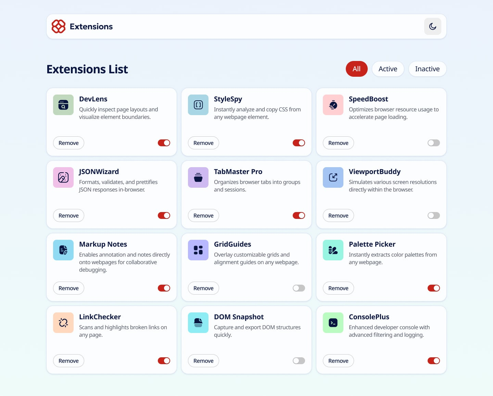
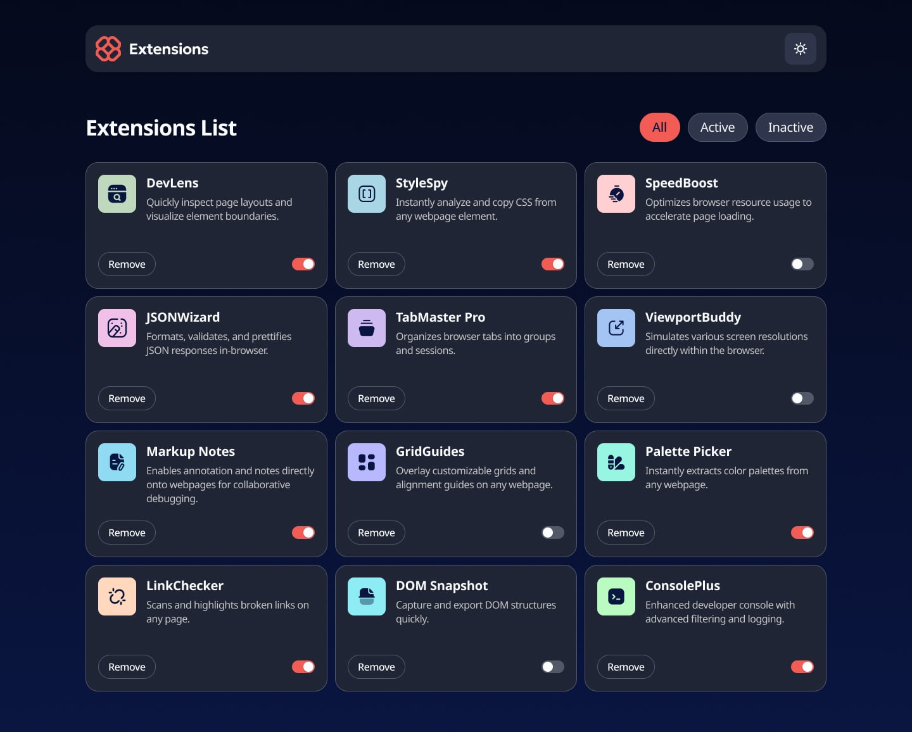

# 🔌 مدیریت افزونه‌های مرورگر

---

### 📸 اسکرین‌شات‌ها

  
  

---

### ✨ ویژگی‌ها

- ✅ واکنش‌پذیری کامل (Desktop-first)
- ✅ حالت روشن و تاریک با ذخیره‌سازی
- ✅ Filtering پیشرفته: همه / فعال / غیرفعال
- ✅ رندرینگ داینامیکی داده‌ها
- ✅ تغییر وضعیت فعال/غیرفعال
- ✅ حذف افزونه‌ها
- ✅ ذخیره‌سازی وضعیت با localStorage

---

### 🛠️ تکنولوژی‌های استفاده‌شده

- HTML5 معنایی
- CSS3 (متغیرهای سفارشی، BEM Methodology، Flexbox و Grid)
- Vanilla JavaScript (ES6+)
- Vite به عنوان Build Tool
- GitHub Pages برای استقرار

---

### 🎯 پیاده‌سازی کلیدی

**مدیریت وضعیت:**
- رندرینگ داینامیکی از داده‌های JSON
- ذخیره‌سازی با localStorage
- Event Delegation برای عناصر داینامیک

**تغییر تم:**
- تبدیل بین حالت روشن و تاریک
- CSS Custom Properties برای theming
- ذخیره‌سازی ترجیح کاربر

**سیستم Filtering:**
- تب‌های همه / فعال / غیرفعال
- Filtering بلادرنگ
- به‌روزرسانی فهرست پویا

---

### 🙏 قدردانی‌ها

- چالش توسط [Frontend Mentor](https://www.frontendmentor.io?ref=challenge)
- طراحی و مشخصات از Frontend Mentor

---

ساخته شده با ❤️ توسط [Arvin Dev](https://github.com/Arvin-M-Dev)
